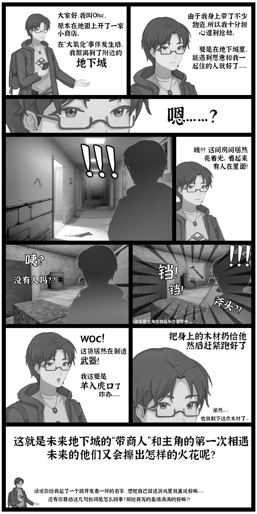
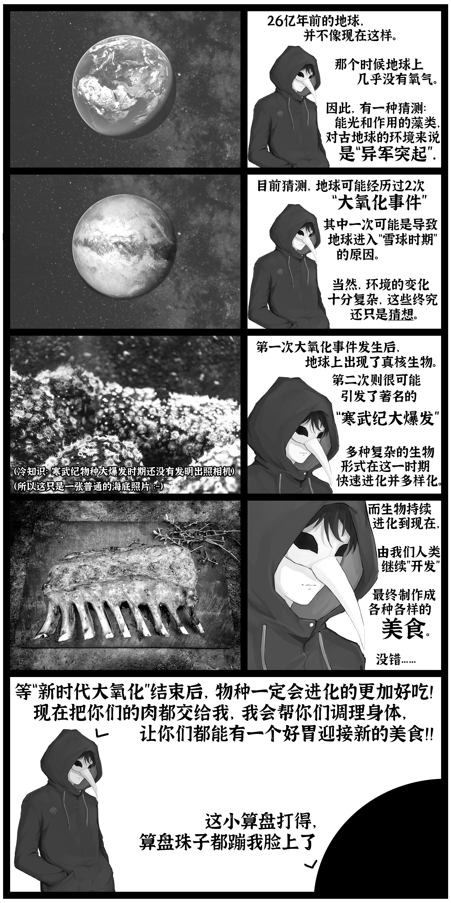
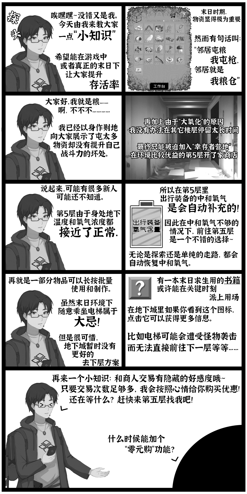

# 《大氧化》世界观与剧情总览

## 世界观设定

海洋核废水泄露引发全球辐射，变异藻类“N藻”随洋流爆发。它不仅疯狂进行光合作用，还能吸收氮气与水制造氧气，导致地表氧浓急剧升高、二氧化碳骤减，温室效应退却，气温飞快下滑。人类尝试以武器清除却收效甚微。辐射与寒冷合力催生陆地生物变异与灭绝潮。各地紧急修建或启用地下城以求庇护，但并非所有设施可用，也不是所有设施都有幸存者。你在这场“大氧化”之中，独自躲入一处地下室与房间，维系生存，等待未知的救援。

## 生存起点

房间是你的核心据点：工作台用于制作与升级，火炉通过燃烧中和室内过高的氧浓并提供温度与烹饪，水桶净化水源兼顾酿造与升级功能，种植区维持少量作物。门因怪物追击而破损，需要“堵门”维护；它也是唯一的外出通道。出行装备提供低氧供给与保温、防辐射防护，出门自动穿着，回家自动脱下。在城市各层探索时，注意中和氧气含量与房门完整度，合时机返家修补与补给。

## NPC 剧情线

### 幸存者访客（???）

你回到房间时，门口出现一位慌张的陌生人。他误以为这里是空房间，发现有人居住后不断道歉，强调自己没有武器与恶意。临走前，他把在外收集的木材留在你的储物柜里，表达歉意与祝愿。若他能活下去，说不定还会再遇到。（事件结束后获得木材馈赠），这也是你和未来地下城里商人Olsc的初次相逢。

进一步描述：他是在卸下出行装备后误闯到你的门前。注意到你的生活痕迹后，他主动表达歉意并尽力避免引起误会。那份留给你的木材既是弥补，也是彼此在废墟中的一种互相守望。此后，你的房间与外界的信息逐步通过“商人”串联起来，这次邂逅是整个信息网络的第一环。

### 艾米（Amy）

在搜索中，你发现一处尚能运作的庇护所。角落里蜷缩着一个小女孩，她饥饿、恐惧，害怕陌生人。房间仍有电力与火炉，却几乎没有水与食物。她自称“艾米”，父亲在撤离第一晚外出“赶走怪物”后再未归来。你安抚她谨慎度，不鼓励擅自离开，并尝试评估与捐助她的物资。

- 生存检测：艾米的饱食与燃烧由你捐助的物资与木材维系。若木材缺失两天或饱食缺失超时，她将死亡；若持续捐助与关照，好感度上升。
- 结局分支：
  - 悲剧：在资源断供与时间流逝下，她死于饥寒。你可回收她遗留物资，心情沉重地离开。
  - 温情：好感达到上限后，她鼓起勇气向你表达信任，你获得一把小型手枪与子弹，新的希望注入你的房间。
- 互动余波：离开时她会与你告别；你也可以选择“拿走物资”，这会重置她的好感，留下冷硬的现实选择。

补充细节：艾米对时间的概念已经模糊，她只能记得“第一晚父亲出门”这一断点。她会把你视作少数的安全来源。当你带着更多食物回来，她会明显放松；当你把她的储备拿走，她会紧张而沉默。系统通过“燃烧时长/饱食时长”来持续评估她的生存状态，这使每一次捐助都成为叙事中的关键片段。

### 商人（地下城五层最后一个房间）

在与上文“幸存者访客”相遇后不久，你遇到一位在地下城游走的商人。他经营每日刷新的小店，可买卖各 8 格物品，支持预约某件商品重刷，好感度影响交易折扣。他不仅可以进行交易，还分享关于地下城与地表的消息：

- 幸存者营地：第五层有组织化的“营地”，名为分配资源，实则强盗作派。“只有能带来利益的人才会被列为友好。”
- N藻近况：地表气温变冷，海面结冰，N藻繁殖受制；清理工作仍在继续，或许重返地面并不遥远。
- 艾米：他听说地下城中仅有一位幸存者成功带下孩子；你与她的遭遇，是难得的好消息。
- 奇异事件：他也听闻裂缝里的神秘气味与“奇怪的植物”，以及突然出现的“奇怪的门”。这些都在引导你踏入另一条故事线。

#### 商人咨询总览

- 触发与入口：好感度达到一定阈值后出现“更多咨询”。不同话题随你推进相关剧情节点逐步解锁，包括幸存者营地、艾米、盗贼、神秘人、奇怪植物与奇怪的门。
- 幸存者营地（资源秩序与强取）：
  - 组织位于第五层，名为资源分配，实则以利益划分“友好”，弱者难以立足。
  - 营地内医生曾关注“奇怪植物”感染；其后营地对陌生人更为防范。
- N藻（地表变局）：
  - 海面结冰限制其繁殖，清理工作持续推进；重返地表有望但尚无时间表与细节。
- 艾米（小女儿）：
  - 地下城仅有一位幸存者成功带下孩子；建议不要让孩子来第五层，这里“环境舒适但恶意太多”（比如和强盗无异的幸存者营地）。
- 盗贼（夜间盗窃的余波）：
  - 营地早期曾遭偷窃，之后不再欢迎陌生人，并组织过搜查；商人对后续并不知情。
- 神秘人（裂缝与调养）：
  - 做“调养”的人多由营地去光顾，商人仅偶有耳闻，暗示其与营地及裂缝线存在交集。
- 奇怪植物（“寒霜症”）：
  - 早期撤离地下城时出现了奇怪病毒，症状为植物根扎入皮肤导致虚弱直至死亡；最可怖的是“死亡后意识仍在”。
  - 医生观察后未见新增病例，推测早发性非持续传染；营地因此分裂，甚至有人觊觎“死而不灭”的奇效。
  - 植物与宿主脑部缠绵，宿主随植物死亡而亡；感染者可能获得抗严寒能力，但需大量进食，解释外界“尚能动弹”的各类怪物。
  - 病名暂定为“寒霜症”。
- 奇怪的门（禁忌档案）：
  - 商人劝阻继续打探，并点出《莱瑟塔档案》，暗示涉及更深层的危险与知识禁区。

#### 传言角色与隐线索（商人口述）

- 营地医生：最早追踪“奇怪植物”的医疗角色，判断其非持续传染，并提出“寒霜症”的术语与生理机理。他的判断是理解伊娜线的关键背景，但正章中并未直接登场。
- 调养者：营地里少数会去裂缝处做“调养”的人，维持精神与肉体的特殊方法；商人仅偶有耳闻，暗示其与神秘人线存在交集。
- 档案作者（莱瑟塔档案）：与“奇怪的门”相关的禁忌知识源头。商人强烈建议不再追问，意味着档案涉及危险组织或超常实体，可能与“同族”线相接。

#### 交易与预约的剧情勾连

- 预约：可在商人处预约心仪物资，提升物资出现的概率，提高关键道具获取节奏。
- 特殊折扣日：推进剧情“香草二型”后，次日早晨会出现半价折扣日，商店买卖折扣同步下调，形成与“伊娜线”之间的互相勾连。

#### 环扣关系与解锁节奏

- 营地→盗贼：早期偷窃促使营地防范升级，幸存者营地剧情线推进后解锁相关咨询。
- 裂缝→神秘人→奇怪植物：裂缝线引出调养与植物话题，可在商人处补充医学与风险信息。
- 奇怪植物→伊娜：寒霜症设定与“温度/进食”暗示对伊娜线进行铺垫。
- 香草二型→商店折扣：推进草线触发商店特殊折扣日，便利下一段探索与准备。

### 幸存者营地（强取豪夺与内部分裂）

你在外遭遇穿盔甲的男人与随行者，他们自称营地，态度从试探到施压。之后，他们甚至闯至你房门前，先是警告，再是索要物资：若交出“白酒×5、烤肉×30”，他们心满意足、冲突暂缓；若拒绝，便以战斗相威逼。

- 选择与后果：
  - 交出：强盗高兴，营地暂时偃旗息鼓，威胁指数下降。
  - 拒绝：触发战斗流程，并和幸存者营地结仇，未来会在探索地下城时有概率碰到并爆发冲突。

内部分裂与传言补完：营地在早期撤离与盗窃事件后，逐渐走向对陌生人的全面防范。更隐秘的分裂源于“奇怪植物”的传言——有一派相信“死亡后意识仍在”的奇效值得追求，另一派认为这是恐怖的禁忌。营地医生的谨慎结论（非持续传染、植物与宿主脑部缠绵）并未平息贪念，反而让部分人尝试更极端的做法。你与营地的互动因此不再只是交易，更是对派系与伦理的审视。

### 小偷事件（夜间盗窃，与营地防范的因果）

在特定层级，夜间可能遭遇盗窃。小偷不会直面你，而是随机抽走你仓库中堆叠较高的物资。事件结束后，商人的“关于盗贼”的咨询解锁，你可以从他处获取更丰富的情报与建议。

因果关系：商人的口述显示，营地在早期就受到过偷窃，这直接导致他们对陌生人的排斥与搜查。你的夜盗事件不仅是随机风险，也与营地的态度形成呼应：在强取豪夺与内部不信任的环境里，盗窃成为生存者之间互相消耗的另一面。

小偷实际上已死，但尚不能确定究竟是被幸存者营地成员杀害，还是被外界环境或怪物所杀。

### 裂缝与神秘人（香气、液体与调养）

在房间外的裂缝处，传来奇异的香气。你循味而至，遇到一位“神秘人”。他能觉察你携带的特殊液体，并提出“调养”建议：
消耗肉类，进行短时休养以恢复精神与提升暴击。若无液体，他提醒你继续寻找；若有液体且完成一段长谈后，你将开启后续线索。

裂缝与液体：你可在裂缝处放置空瓶，液体需要五天时间缓慢滴入才可收集。收集后，神秘人会更具体地讨论“调养”的方法及其对战斗与生存的影响。液体与调养共同构成身心调节的机制，为后续草线与高风险探索提供支持。

### 伊娜与“地下门”（完整叙事版）

相遇与邀请：你循着“滋滋滋”的杂音来到一间破败的房屋，隔音极差却异常温暖。你敲门提醒屋内的人注意安全，门内女孩请你进来，并自述“这是店铺，但不交易金钱”。她第一句话便问：“如果，你的生命临近尽头，你会希望在临终前，做些什么事呢？”你从此与她的命运绑定。

交易与请求：伊娜翻出地图，标出几个大致位置，请你去寻找她需要的“香草”。她承诺，若你带回，将告诉你一些“秘密”。此刻你可以选择接受或拒绝任务：接受开启“香草线”，拒绝则剧情暂缓。

香草一型：在指定地点取得“香草一型”后归还，她通过长段对话铺垫门的来历、环境异常与自我状况，并让你直产生疑惑。并送给你一道预言：次日固定点会刷新特定怪物，此时会在第二天刷新一个可以无限刷怪的点位。

香草二型：第二次归还后继续对话，她逐步转入更私密的说明：香草与她的身体、基因之间的关系，让你的疑惑更深，感觉她似乎并不是真正的人类。与此同时，她送给你一道新的预言：商店解锁次日“半价折扣日”，前去交易可获得很大收益。

香草三型与真相：第三次归还时，将故事推向高潮。她在你面前强作镇定，提出“最后的预言”。你按住她的手追问“最后是什么意思”，她的泪水终至落下；随后她问你是否愿意相信，并用“远古大氧化—病毒—外星族群战争—核子冬天—祖先迁地下”的漫长叙事揭示身份：“我，并不是人类”。

方法与代价：她解释三株香草是“受侵染却不受影响的特殊品种”，旨在与自身基因结合，待气候回暖与雨水来临，扩散到整颗星球以抵御病毒；她最终以自己的生命作为引子，激活扩散，使所有患“寒霜症”的人得到治愈。你追问是否还有别的办法，她坦言“已经没有更多选择了”。

告白式预言与告别：她用水晶球做“最后的预测”，讲到“你曾拯救过的一位女孩……在生命临终前，喜欢过你的女孩……将会在未来的每一处角落里静静地观望、感谢、守护你”。屋内瓶罐发光，她向你道谢——“让我不再孤独，让我获得了信任，让我认为自己所做的一切都是值得的”，并描绘花丛、草原、阳光与花香的愿景：“如果，我能在那时遇见你，该多好啊”。

雨夜守望与终章通信：雨声在地下城回荡，“可以抵御寒冷的雨水”开始温暖星球，系统把救援日期设定到次日。稍后，你在房间外听到不明声音，通过嘈杂的“对讲机”，陌生人确认你与伊娜的关联，提出“伊娜”可能并没有死，留下伏笔；故事在噪声中落幕，而“伊娜”这个名字被你永远记在心底。

### 只存在于传言的角色与组织（隐线补完）

- 同族：在终章通信与伊娜线中被提及的族群。他们可能与“地下门”有直接联系，掌握超乎寻常的技术或生理适应方式。你在当前章节只能接触其影子。
- 档案与作者：被商人称作“《莱瑟塔档案》”的禁忌资料，映射现实中的一个有关爬虫族的都市传说，暗示知识本身构成危险。涉及门的来历、用途乃至与族群的交互方式，但任何追问在当前进度下都会遭到劝阻。
- 营地医生：虽未正面登场，但从商人口述可确证其在植物感染研究上的权威性与谨慎态度。他提出的“寒霜症”定义与机理，贯穿伊娜线的叙事解释。

  
  
  

